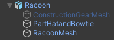

Va jusqu'au **modèle** que tu veux utiliser dans la fenêtre Project.

Fais glisser le modèle dans ta vue Scene.

Tu peux aller dans la fenêtre Inspector pour le nouveau modèle GameObject et le renommer. Tu peux aussi créer et appliquer un tag approprié.

Si ton modèle a des GameObjects enfants associés, tu peux les activer et les désactiver en utilisant la case à cocher située à côté de leur nom dans la fenêtre Inspector.

