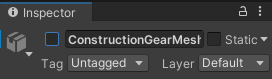

Navigate to the **model** you want to use in the Project window.

Drag the model into your Scene view.

You can go to the Inspector window for the new model GameObject and rename it. You can also create and apply a sensible tag.

If your model has associated child GameObjects, you can enable and disable them using the checkbox next to their name in the Inspector window.

