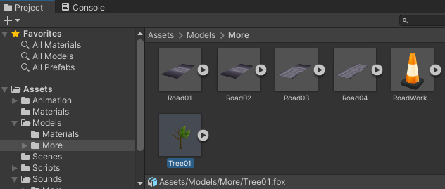

Navigeer naar het **model** dat je wil gebruiken in het Projectvenster.

Sleep het model naar je Scèneweergave.

Je kunt naar het Inspector-venster voor het nieuwe model GameObject gaan en het hernoemen. Je kunt ook een tag maken en toepassen, geef deze een logische naam.

Als je model onderliggende GameObjects gekoppeld heeft, kun je deze inschakelen en uitschakelen met behulp van het selectievakje naast hun naam in het Inspector-venster.

